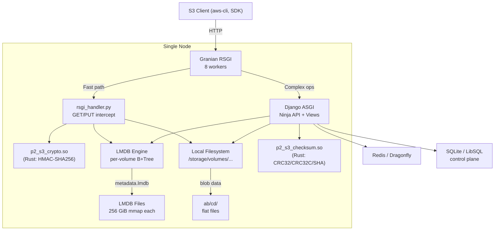
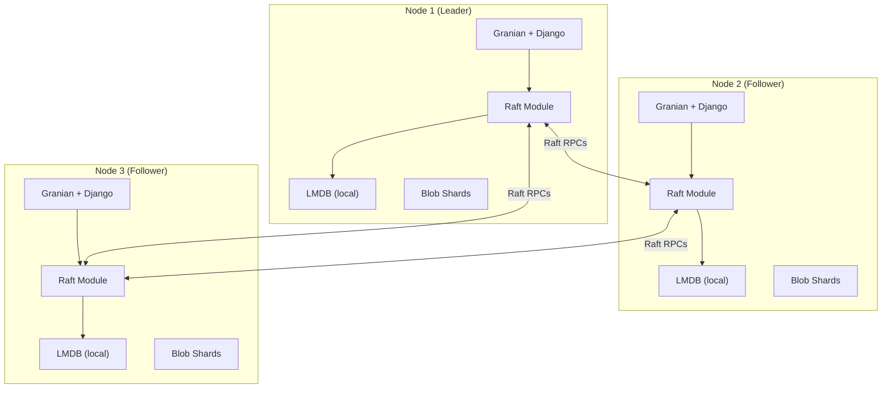
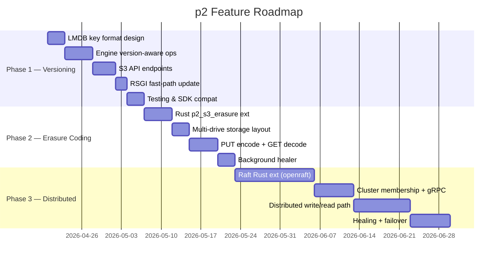

# p2 Research: Distributed Mode, Versioning & Erasure Coding

## Executive Summary

p2 today is a **single-node S3-compatible object store** with:
- **Granian** RSGI/ASGI server (8 workers, Rust sendfile)
- **LMDB** for per-volume object metadata (B+Tree, memory-mapped, lock-free reads)
- **3 Rust PyO3 extensions** (`p2_s3_crypto`, `p2_s3_checksum`, `p2_s3_meta`)
- **Django Ninja** API + web UI, **Django ORM** (SQLite/LibSQL) for control plane
- **Redis (Dragonfly)** for cache + ARQ task queue
- Flat-file blob storage with 2-level UUID sharding (`ab/cd/<uuid>`)

This document covers what's needed to add **Object Versioning**, **Erasure Coding**, and **Distributed operation** — the three pillars that separate a "personal S3" from a production-grade system like MinIO.

---

## Current Architecture Map



### Key Files Touched by These Features

| File | Role | Impact |
|------|------|--------|
| [engine.py](file:///home/ilfs/Public/p2/p2/s3/engine.py) | LMDB wrapper (put/get/delete/list) | Key format changes for versioning; replication layer for distributed |
| [objects.py](file:///home/ilfs/Public/p2/p2/s3/views/objects.py) | PUT/GET/DELETE/HEAD/COPY handlers | Version ID generation, delete markers, erasure encode/decode |
| [buckets.py](file:///home/ilfs/Public/p2/p2/s3/views/buckets.py) | Bucket ops, ListObjectsV2, versioning stub | PutBucketVersioning, ListObjectVersions |
| [rsgi_handler.py](file:///home/ilfs/Public/p2/p2/s3/rsgi_handler.py) | Granian fast-path GET/PUT | Version-aware reads, shard reads for erasure coding |
| [storage_path.py](file:///home/ilfs/Public/p2/p2/core/storage_path.py) | Blob filesystem layout | Shard paths for erasure coding; node-aware paths for distributed |
| [meta_write.py](file:///home/ilfs/Public/p2/p2/s3/meta_write.py) | Batched async LMDB writer | Replication hooks for distributed |
| [models.py](file:///home/ilfs/Public/p2/p2/core/models.py) | Volume/Storage/Component Django models | Versioning config per volume, erasure coding profile |
| [controller.py](file:///home/ilfs/Public/p2/p2/components/replication/controller.py) | Replication component (currently stubbed) | Foundation for distributed replication |

---

## Feature 1: Object Versioning

> [!NOTE]
> This is the **lowest-risk, highest-value** feature. It requires no new infrastructure, no new Rust crates, and no multi-node coordination. It's purely a metadata schema change + API endpoint additions.

### How S3 Versioning Works

| State | PUT behavior | GET behavior | DELETE behavior |
|-------|-------------|-------------|-----------------|
| **Unversioned** (default) | Overwrite in place | Return object | Remove object |
| **Enabled** | Create new version with unique `versionId` | Return latest version (or specific via `?versionId=`) | Insert **delete marker** as latest; old versions preserved |
| **Suspended** | Create new version with `versionId=null` | Same as enabled | Insert delete marker with `versionId=null` |

### LMDB Key Format Change

Currently, LMDB keys are the raw object path:
```
Key:   photos/cat.jpg
Value: {"blob.p2.io/mime": "image/jpeg", "blob.p2.io/size/bytes": "12345", ...}
```

For versioning, we need a **composite key** that preserves B+Tree sort order so the latest version comes first:

```
# Current (unversioned) — no change for unversioned buckets
Key:   photos/cat.jpg
Value: {"blob.p2.io/mime": "image/jpeg", ...}

# Versioned — separate "current pointer" + version entries
Key:   photos/cat.jpg                           ← current pointer
Value: {"_version_id": "abc123", "_is_delete_marker": false, ...full metadata...}

Key:   photos/cat.jpg\x00V\x00<reverse_timestamp>\x00<version_id>
Value: {"_version_id": "abc123", ...full metadata...}
```

**Why `\x00V\x00<reverse_timestamp>`?**
- `\x00` is a null byte that sorts before any printable character, so the current pointer always comes first in a prefix scan
- Reverse timestamp (`9999999999 - unix_ts`) ensures newest versions sort first in LMDB's natural ascending B+Tree order
- This makes `GET /obj` (return latest version) map to the existing code path — just read the current pointer key

### What Needs to Change

#### A. Volume Model — Add versioning state
```python
# models.py — Volume model gets a versioning field
class Volume(UUIDModel, TagModel):
    VERSIONING_CHOICES = [
        ('disabled', 'Disabled'),
        ('enabled', 'Enabled'),
        ('suspended', 'Suspended'),
    ]
    versioning = models.CharField(max_length=10, default='disabled',
                                  choices=VERSIONING_CHOICES)
```

#### B. Engine — Version-aware operations

| Operation | Unversioned (no change) | Versioned |
|-----------|------------------------|-----------|
| `put(path, json)` | Overwrite key | 1. Generate `version_id` (UUID or ULID)<br/>2. Write version key `path\x00V\x00<rev_ts>\x00<vid>`<br/>3. Update current pointer key `path` |
| `get(path)` | Return value | Return current pointer value |
| `get(path, version_id)` | N/A (new) | Scan version keys, find matching `vid` |
| `delete(path)` | Delete key | 1. Write delete-marker version<br/>2. Update current pointer to delete marker |
| `delete(path, version_id)` | N/A (new) | Delete specific version key; if it was current, promote next |
| `list_versions(prefix)` | N/A (new) | Scan all `prefix\x00V\x00...` keys |

#### C. New S3 API Endpoints Needed

| Endpoint | Method | Status in p2 |
|----------|--------|-------------|
| `PutBucketVersioning` | `PUT /<bucket>?versioning` | **Stubbed** — returns `<Status>Disabled</Status>` |
| `GetBucketVersioning` | `GET /<bucket>?versioning` | **Stubbed** — same |
| `ListObjectVersions` | `GET /<bucket>?versions` | **Missing** |
| `GET /obj?versionId=X` | `GET` | **Missing** |
| `DELETE /obj?versionId=X` | `DELETE` | **Missing** |
| `HEAD /obj?versionId=X` | `HEAD` | **Missing** |

#### D. Response Header Changes
- All responses for versioned objects must include `x-amz-version-id`
- DELETE responses must indicate if a delete marker was created
- ListObjectsV2 responses continue to show only the latest non-deleted version (no change)

### Estimated Effort
- **Engine changes**: ~200 lines in `engine.py`
- **View changes**: ~300 lines across `objects.py`, `buckets.py`
- **Model migration**: ~20 lines
- **RSGI fast-path update**: ~50 lines
- **Total**: ~600 lines, no new dependencies

---

## Feature 2: Erasure Coding

> [!IMPORTANT]
> Erasure coding makes sense even on a **single node with multiple drives**. MinIO uses it to survive drive failures. For p2, this means storing objects as Reed-Solomon shards across N drives/paths instead of a single flat file.

### How MinIO Does It

1. Object arrives → split into **K data shards**
2. Reed-Solomon generates **M parity shards** (total N = K + M)
3. Each shard written to a different drive in the "erasure set"
4. Object can be reconstructed from any K of N shards
5. Supports `EC:K` from `EC:0` (no parity, max space) to `EC:N/2` (max parity, 50% overhead)

Common configurations:
| Drives | K (data) | M (parity) | Overhead | Survives |
|--------|---------|------------|----------|----------|
| 4 | 2 | 2 | 2x | 2 drive failures |
| 8 | 4 | 4 | 2x | 4 drive failures |
| 16 | 8 | 8 | 2x | 8 drive failures |
| 8 | 6 | 2 | 1.33x | 2 drive failures |

### Rust Extension: `p2_s3_erasure`

This is the ideal candidate for a new Rust PyO3 extension. Reed-Solomon encoding/decoding is CPU-intensive and benefits massively from SIMD (AVX2/AVX512) acceleration.

**Recommended Rust crate**: [`reed-solomon-erasure`](https://crates.io/crates/reed-solomon-erasure) — mature, supports `galois_8` (GF 2^8), SIMD-optimized.

```toml
# New Cargo.toml for p2_s3_erasure
[package]
name = "p2_s3_erasure"
version = "0.1.0"
edition = "2021"

[lib]
name = "p2_s3_erasure"
crate-type = ["cdylib"]

[dependencies]
pyo3 = { version = "0.23", features = ["extension-module"] }
reed-solomon-erasure = { version = "6", features = ["simd-accel"] }

[profile.release]
opt-level = 3
lto = "fat"
codegen-units = 1
```

**Python API surface:**
```python
# p2_s3_erasure — exposed functions
def encode(data: bytes, data_shards: int, parity_shards: int) -> list[bytes]:
    """Split data into K+M shards. Returns list of shard bytes."""

def decode(shards: list[bytes | None], data_shards: int, parity_shards: int) -> bytes:
    """Reconstruct from available shards. None = missing shard."""

def verify(shards: list[bytes], data_shards: int, parity_shards: int) -> bool:
    """Check if all shards are consistent (bit-rot detection)."""
```

### Storage Layout Change

Currently:
```
/storage/volumes/<vol_uuid>/ab/cd/<blob_uuid>       ← single flat file
```

With erasure coding:
```
/storage/volumes/<vol_uuid>/ab/cd/<blob_uuid>.d0     ← data shard 0
/storage/volumes/<vol_uuid>/ab/cd/<blob_uuid>.d1     ← data shard 1
/storage/volumes/<vol_uuid>/ab/cd/<blob_uuid>.p0     ← parity shard 0
/storage/volumes/<vol_uuid>/ab/cd/<blob_uuid>.p1     ← parity shard 1
```

Or, ideally, across different mount points / drives:
```
/storage/drive0/volumes/<vol>/ab/cd/<blob>.s0
/storage/drive1/volumes/<vol>/ab/cd/<blob>.s1
/storage/drive2/volumes/<vol>/ab/cd/<blob>.s2
/storage/drive3/volumes/<vol>/ab/cd/<blob>.s3
```

### Metadata Changes

```json
{
    "blob.p2.io/mime": "image/jpeg",
    "blob.p2.io/size/bytes": "1048576",
    "blob.p2.io/erasure/profile": "4+2",
    "blob.p2.io/erasure/shard_size": "262144",
    "blob.p2.io/erasure/shards": [
        "/storage/drive0/volumes/.../blob.s0",
        "/storage/drive1/volumes/.../blob.s1",
        "/storage/drive2/volumes/.../blob.s2",
        "/storage/drive3/volumes/.../blob.s3",
        "/storage/drive4/volumes/.../blob.s4",
        "/storage/drive5/volumes/.../blob.s5"
    ],
    "internal_path": "ERASURE_CODED"
}
```

### What Needs to Change

| Component | Change |
|-----------|--------|
| **New Rust ext** `p2_s3_erasure` | Encode/decode/verify via PyO3 |
| **Volume/Storage model** | Erasure profile per volume (`data_shards`, `parity_shards`), drive pool |
| **`storage_path.py`** | Multi-drive shard placement logic |
| **`objects.py` PUT** | After body read → call `p2_s3_erasure.encode()` → write shards to drives |
| **`objects.py` GET** | Read available shards → call `p2_s3_erasure.decode()` → stream to client |
| **`rsgi_handler.py`** | Can't use `response_file()` for erasure-coded objects; must decode + stream |
| **Multipart** | Each completed multipart object gets erasure-coded at finalization |
| **Background healer** (ARQ task) | Periodically verify shards, reconstruct missing ones |

### Configuration Model

```python
# New Django model or Volume tag
class ErasureProfile:
    """Defines the erasure coding parameters for a volume."""
    data_shards: int = 4       # K
    parity_shards: int = 2     # M  
    drives: list[str] = [      # Mount points
        "/storage/drive0",
        "/storage/drive1",
        # ...
    ]
```

### Estimated Effort
- **Rust extension**: ~150 lines
- **Storage path changes**: ~100 lines
- **PUT/GET rewrite for EC path**: ~400 lines
- **RSGI handler update**: ~100 lines
- **Healer background task**: ~200 lines
- **Total**: ~950 lines + new Cargo project

---

## Feature 3: Distributed Mode

> [!CAUTION]
> This is the **most architecturally significant** change. It requires solving: cluster membership, metadata consensus, data placement, and inter-node communication. It should be tackled **last**, after versioning and erasure coding are stable.

### The LMDB Problem

LMDB is a **local-only**, memory-mapped embedded database. It cannot:
- Replicate to other nodes
- Be placed on a network filesystem (NFS/FUSE) — this causes corruption
- Stream changes (no WAL/changelog)

**For distributed mode, we need a strategy for metadata that works across nodes.**

### Architecture Options

#### Option A: Embedded Raft (Recommended for p2)

Each p2 node runs an embedded Raft consensus module. The metadata state machine is LMDB — Raft log entries are replayed into each node's local LMDB.



**Pros**: Single binary, no external dependencies, p2 *is* the cluster
**Cons**: Must implement Raft log storage, transport, snapshotting
**Rust crate**: [`openraft`](https://crates.io/crates/openraft) — async-native, highly modular, well-documented

#### Option B: External Consensus (etcd / Consul)
Use etcd or Consul as a distributed metadata store instead of LMDB.

**Pros**: Battle-tested, zero consensus code to write
**Cons**: Operational overhead (3-5 node etcd cluster alongside p2), another moving part

#### Option C: Metadata in Redis Cluster
Use Redis Cluster (you already have Dragonfly) as the metadata store.

**Pros**: Already in stack, very fast reads
**Cons**: Redis persistence isn't designed for durable metadata at scale, cluster mode adds complexity

### Recommended: Option A (Embedded Raft via Rust Extension)

This aligns with p2's philosophy of **Rust extensions for hot paths** and **single-binary deployment**. A new `p2_cluster` Rust extension would:

1. Implement Raft consensus using `openraft`
2. Expose a Python API via PyO3 for `propose_write()`, `read_local()`, `join_cluster()`, `cluster_status()`
3. Use LMDB as the Raft state machine backend
4. Use gRPC (already in p2) for inter-node Raft RPCs

### Cluster Components Needed

| Component | Purpose | Implementation |
|-----------|---------|----------------|
| **Cluster Registry** | Track which nodes exist, their addresses, health | Django model + gossip/gRPC heartbeat |
| **Data Placement** | Decide which node(s) store each object's shards | Consistent hashing with virtual nodes |
| **Metadata Replication** | Keep LMDB in sync across nodes | Raft log → LMDB state machine |
| **Data Replication / EC** | Spread shards across nodes (not just local drives) | Extend erasure coding to use node addresses |
| **Request Routing** | Forward requests to the correct node | Reverse proxy or client-side redirect |
| **Healing** | Detect and repair missing/corrupt shards on failed nodes | ARQ background job + gRPC data transfer |

### Write Path (Distributed)

```
1. Client → PUT /bucket/key → any p2 node
2. Node computes erasure shards
3. Node proposes metadata write via Raft
4. Raft replicates to majority → commit
5. Node writes data shards to target nodes (via gRPC streaming)
6. Returns 200 to client
```

### Read Path (Distributed)

```
1. Client → GET /bucket/key → any p2 node
2. Node reads metadata from local LMDB (Raft-replicated, consistent)
3. Metadata contains shard locations (node + path)
4. If local shards available → serve from local disk (fast path, sendfile)
5. If remote shards needed → gRPC stream from peer nodes → reassemble
6. Stream to client
```

### Inter-Node Communication

p2 already has a gRPC service ([grpc](file:///home/ilfs/Public/p2/p2/grpc)). New RPCs needed:

```protobuf
service P2Cluster {
    // Raft consensus RPCs
    rpc AppendEntries(AppendEntriesRequest) returns (AppendEntriesResponse);
    rpc RequestVote(VoteRequest) returns (VoteResponse);
    rpc InstallSnapshot(stream SnapshotChunk) returns (SnapshotResponse);
    
    // Data plane RPCs
    rpc WriteShard(stream ShardData) returns (WriteShardResponse);
    rpc ReadShard(ReadShardRequest) returns (stream ShardData);
    rpc HealthCheck(Empty) returns (NodeStatus);
    
    // Healing
    rpc ListShards(ListShardsRequest) returns (stream ShardInfo);
    rpc RepairShard(RepairRequest) returns (RepairResponse);
}
```

### Estimated Effort
- **Raft Rust extension** (`p2_cluster`): ~2000 lines Rust
- **Cluster Django app**: ~500 lines Python (models, management commands)
- **gRPC protos + services**: ~400 lines
- **Data placement (consistent hashing)**: ~300 lines
- **Distributed write/read path**: ~600 lines
- **Healing background tasks**: ~300 lines
- **Docker Compose multi-node setup**: ~100 lines
- **Total**: ~4000+ lines, significant architectural change

---

## Phased Implementation Plan



### Phase 1: Object Versioning (Recommended Start)
- **Risk**: Low — metadata-only change, backward compatible
- **Dependencies**: None
- **Reversibility**: Unversioned buckets are completely unchanged
- **Value**: High — core S3 compatibility feature

### Phase 2: Erasure Coding
- **Risk**: Medium — changes the data storage layout
- **Dependencies**: New Rust crate (`reed-solomon-erasure`)
- **Prerequisite**: Multi-drive configuration support in Volume model
- **Value**: High — data protection, drive failure tolerance

### Phase 3: Distributed Mode
- **Risk**: High — fundamental architecture change
- **Dependencies**: Phase 2 (erasure coding across nodes), Raft implementation
- **Prerequisite**: Robust single-node with versioning + EC
- **Value**: Very High — horizontal scaling, high availability

---

## Open Questions for Your Decision

> [!IMPORTANT]
> **1. Versioning scope**: Should we support all three states (Disabled → Enabled → Suspended → Enabled...) like AWS S3, or just Disabled/Enabled for simplicity?

> [!IMPORTANT]  
> **2. Erasure coding — single node first?** Should EC start with multiple local drives on a single node (like MinIO standalone), or jump straight to multi-node sharding?

> [!IMPORTANT]
> **3. Distributed consensus**: Embedded Raft (single binary, more work) vs. external etcd (extra service, less code)? The stub [replication controller](file:///home/ilfs/Public/p2/p2/components/replication/controller.py) suggests replication was already planned — should we resurrect it as a simpler first step before full Raft?

> [!IMPORTANT]
> **4. Version ID format**: UUID (opaque, random) vs. ULID (time-ordered, sortable) vs. timestamp-based? ULIDs have nice properties for LMDB key ordering.

> [!IMPORTANT]
> **5. Migration**: Should existing unversioned LMDB databases be migrated in-place, or should versioning only apply to newly created buckets?
